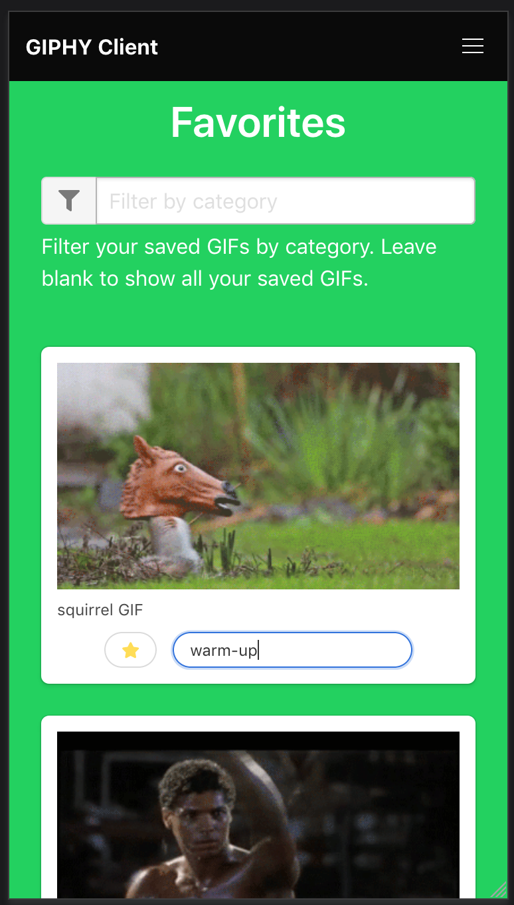

giphy api
=========
A WebAssembly application that allows a user to search for and save animated GIFs to a user profile using the [GIPHY API](https://developers.giphy.com/docs/).

### overview
#### api
The API is structured as a very simple old school REST API written in Rust. The client & server use the same exact data models for communicating over the network. All interaction is protected by JWT authN/authZ.

#### client app
The client app is a WebAssembly (WASM) application built using Rust.

#### database
We are using MongoDB as the backend for this system. We are using an ODM, called [Wither](https://github.com/thedodd/wither), which I created. This allows us to deal with our MongoDB collections in a model-first fashion.

#### setup
First, ensure you have [docker](https://docs.docker.com/install/#supported-platforms) & [docker compose](https://docs.docker.com/compose/install/) installed on your system. Everything in this system is intended to run entirely within docker.

```bash
# Once you have docker in place, booting the entire system is just one comamnd.
# NOTE: when first run, it will take some time to compile the client & server.
docker-compose up -d

# Stream the logs to ensure everything has come online as needed.
docker-compose logs -f

# You can access the MongoDB instance via the following command.
docker-compose exec mongo mongo
```

Now you're ready to start using the app. Simply navigate to http://localhost:8080 to get started.

----

### deep dive
##### auth
We are using `2048` bit RSA asymmetric keys for creating and verifying our JWTs. The code block below shows how to create a new key pair. The keys must be base64 encoded before being passed into the container runtime environment.
```bash
# Generate new private & public key pair.
openssl genrsa -out /tmp/keypair.pem 2048

# Extract the private key.
openssl rsa -in /tmp/keypair.pem -out /tmp/private.key

# Extract the public key.
openssl rsa -in /tmp/keypair.pem -pubout -out /tmp/public.key
```

----

### demo images mobile



